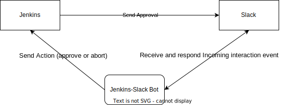

# Jenkins-Slack Bot 

## Table of contents
- [Overview](#overview)
- [Requirements](#requirements)
- [Setup](#setup)
- [Run the app](#running-the-app)
- [Pipeline Example](#pipeline-example)
- [Contribution](#contribution)
- [TODO](#todo)

### Overview

Here's the diagram of the flow on what this repo is about


here is also the working demonstration on how this repository should work
[](https://youtu.be/kbix7WRzgLI)

### Requirements
- Slack app with socket mode enabled
- Jenkins slack plugin
- Go >=1.20

### Setup
#### Create Slack App 

You have options regarding slack app. You can create a new app dedicated for jenkins-bot-go and slack jenkins plugin. Or use existing app. Install it to your slack workspace.

Get the App Token in `Settings -> Basic Information` section, scroll down and you will see App Token. Create a new and add these scopes:
- `connections:write`
- `authorization:read`


Next, you need to obtain the Bot Token. Go to `Features -> OAuth & Permissions`. 

Go to Scopes section and add these OAuth Scope:
- `chat:write`
- `im:history`

Scroll up and copy the bot token.


#### Install and configure Slack jenkins plugin 

Ensure that you have slack plugin in jenkins installed. You can go to `Manage Jenkins -> Plugins -> Available Plugins` to check whether if it's already installed.
Otherwise, go to  `Available Plugins` and search `slack` then install it.


Next, create credentials to securely store your slack bot token for slack jenkins plugin.
Go to `Manage Jenkins -> Credentials`. You have options to isolate the credentials with domain credentials, but for now you can click `(global)` under `Domain` column. 
You can then click `Add Credentials`

For these fields:
- `Kind` choose `Secret Text`
- `Scope` choose `Global`
- `Secret` with your slack bot token
- `ID` is up to you, for example: `slack-token`. This will be used for reference later in exposing your slack bot token to the installed slack plugin
- `Description` is also up to you. You can put the information about what secret it is and why do you need it. 

Then click `Create` button


Next step is connecting your saved slack credential and slack plugin. Go to `Manage Jenkins -> Slack`. 
Fill in the `Workspace` with your Slack workspace and put your recently created slack credential in `credential` field.


#### Setup jenkins-bot-go
- Clone the repository
- run this to download the dependencies
```shell
go mod download
```
- Copy `.env.example` and modify them according to your configuration
  - for `JENKINS_URL`, you need to put your jenkins URL. for example: `http://jenkins.localhost`
  - for `JENKINS_USERNAME`, you can use the current username (`admin` for example) you're logged in to your Jenkins. Make sure you have access to the necessary pipeline jobs that is about to be integrated with the 
  - for `JENKINS_USER_API_TOKEN`, you can obtain it in your profile by clicking your name next to `Logout` button then click `Configure`. Go to `API Token` section and create one for the jenkins bot go 
  - `SLACK_BOT_TOKEN` will be your slack bot token
  - `SLACK_APP_TOKEN` will be your slack bot token
  - `APP_LOG_LEVEL` you can choose between `error`, `info`, `debug`

### Running the app

You can use this command to run it by running it directly from the source
```shell
go run ./delivery/server
```

### Pipeline Example

Create a new pipeline and copy this to see if it's working fine

```
stage("Setup") {
    def thread = slackSend(channel: "#notification", attachments: [[
        "text": "Proceed to deploy?",
        "fallback": "Proceed to deploy?",
        // this bit is important for build identification for jenkins-bot-go
        "callback_id": "${env.JOB_NAME}:${env.BUILD_NUMBER}", 
        "color": "#3AA3E3",
        "attachment_type": "default",
        "actions": [
            [
                "name": "prompt",
                "text": "Abort",
                "type": "button",
                "style": "danger",
                "value": "abort"
            ],
            [
                "name": "prompt",
                "text": "Approve",
                "type": "button",
                "style": "primary",
                "value": "approve",
            ]
        ]
    ]])
    def replacement = ""
    try {
        def approval = input(message: "Proceed to deploy?", parameters:[
            // this is required for jenkins-bot-go to send the submitter. currently it's slack user id. 
            string(name: "SLACK_SUBMITTER", defaultValue: "Admin", description: "Submitter") , 
        ])
        println "approved by ${approval}"
        replacement = "deployment approved by <@${approval}>"
    } catch (hudson.AbortException e) {
    } catch (org.jenkinsci.plugins.workflow.steps.FlowInterruptedException e) {
        replacement = "deployment abborted"
    } catch (Exception e) {
        replacement = "something went wrong. Error: ${e.messsage}"
        throw e
    } finally {
        slackSend(channel: thread.channelId, timestamp: thread.ts, attachments: [[
            "text": replacement,
        "fallback": replacement,
            ]])
    }
}
```

You can also build the binary and put it in your server or even build it in container and deploy it in your cluster. 

### Contribution

PR or Issue submission are very much welcome. I will do my best to engage and resolve the said items.

### Support

Issues will be reviewed and resolved at best effort. 
However, if you need further assistance, do not hesitate to contact me at [my email](mailto:mgufronefendi@gmail.com)

### TODO

- [x] Initial Release
- [ ] Expand to other communication channel
  - [ ] Telegram
  - [ ] Mattermost
  - [ ] ...
- [ ] Integrate to other CI/CD tools if possible
- [ ] Allow Jenkins to directly send API request to jenkins-bot-go that will send approval message to Slack
